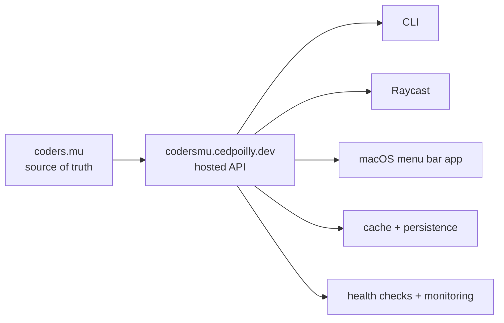
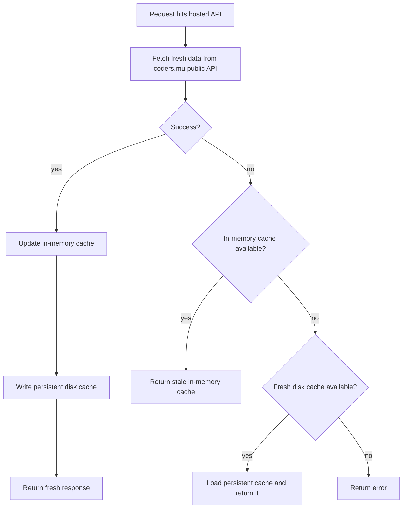
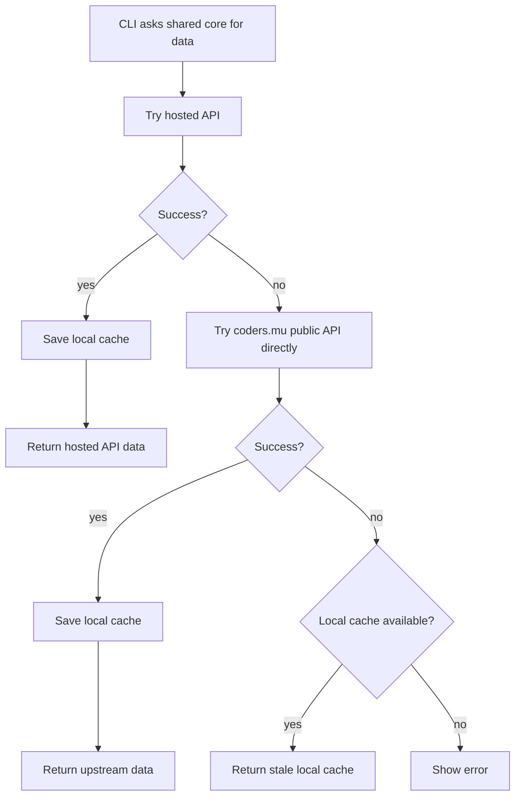
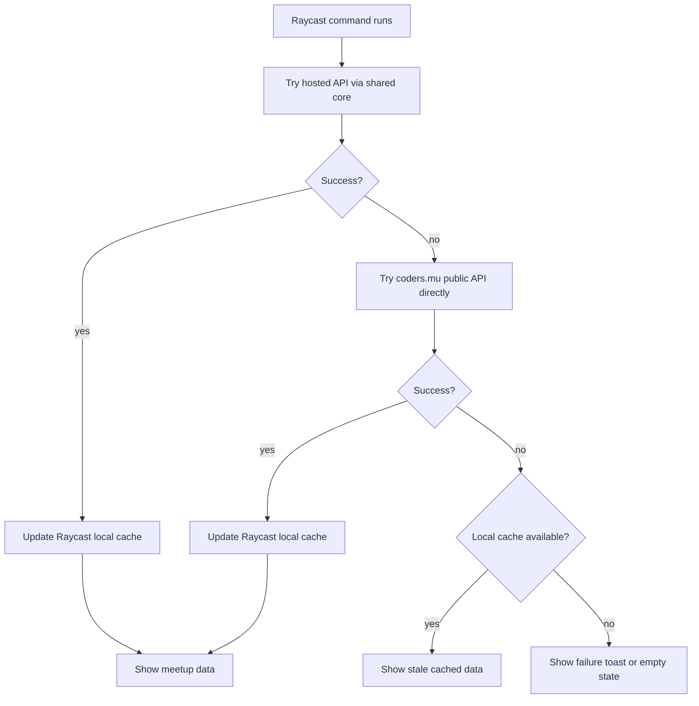
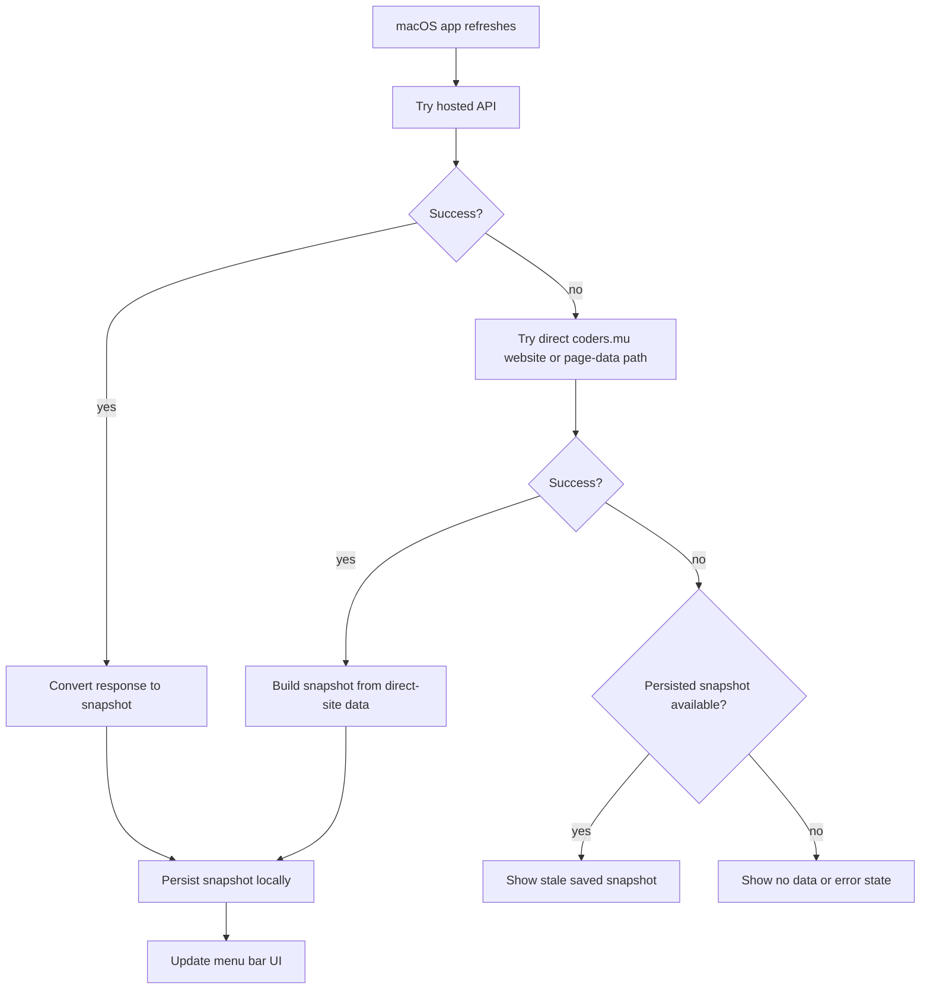
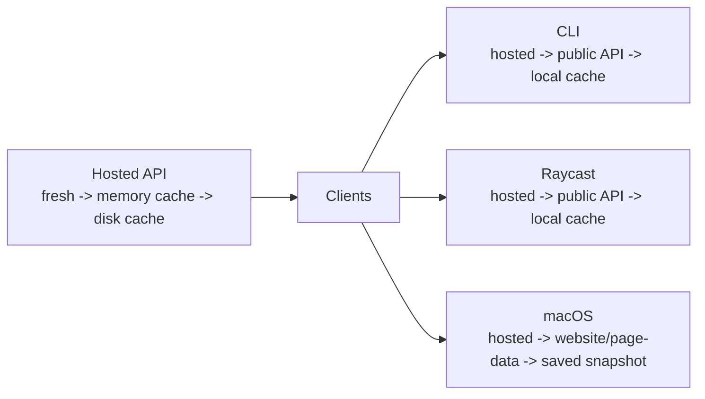
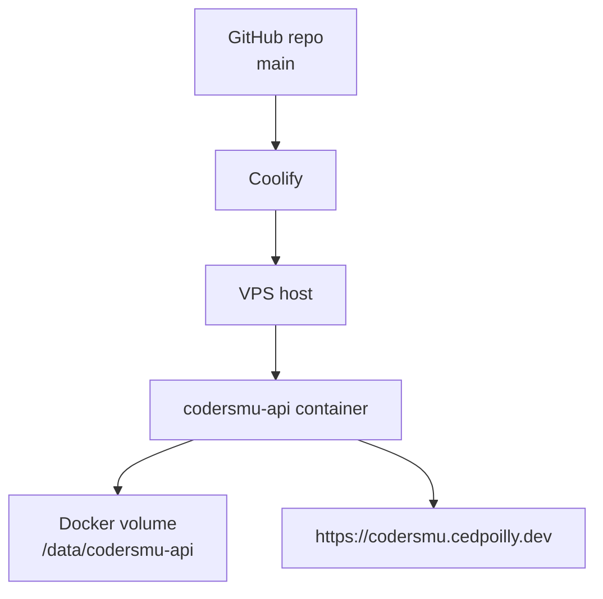

# codersmu-clients Architecture

This document describes the current runtime shape of `codersmu-clients`, the role of the hosted API, and how fallback works for each client.

## Overview

At a high level:

- `coders.mu` remains the source of truth
- `codersmu.cedpoilly.dev` is the reliability layer in front of it
- CLI, Raycast, and macOS all prefer the hosted API
- each layer has its own fallback behavior

## Main Components

### Upstream Truth

- `coders.mu` website and public API are the source of truth
- the hosted API reads from the public API endpoint at `https://coders.mu/api/public/v1`
- the macOS fallback path can also read direct page data from the website

### Hosted API

The hosted API lives at `https://codersmu.cedpoilly.dev` and is implemented in:

- [apps/api/src/server.ts](./apps/api/src/server.ts)
- [apps/api/src/meetups.ts](./apps/api/src/meetups.ts)

It exposes:

- `GET /health`
- `GET /meetups?state=all|upcoming|past`
- `GET /meetups/next`
- `GET /meetups/:slug`

It adds:

- a stable client-facing contract
- short-lived in-memory caching
- persistent disk cache for cold-start fallback
- health metadata and release metadata
- structured logs for operations

### Shared Core

The shared TypeScript client and provider logic lives in:

- [packages/core/src/client.ts](./packages/core/src/client.ts)
- [packages/core/src/providers/frontendmu-api.ts](./packages/core/src/providers/frontendmu-api.ts)

CLI and Raycast use this layer directly.

### Client Surfaces

- CLI uses the shared core and a local cache
- Raycast uses the shared core and a local cache inside the extension support directory
- macOS uses the hosted API first, but keeps its own direct-site fallback path

Relevant files:

- [apps/raycast/src/lib/cmu.ts](./apps/raycast/src/lib/cmu.ts)
- [apps/macos/CodersmuMenuBar/Services/API/CodersMuAPIClient.swift](./apps/macos/CodersmuMenuBar/Services/API/CodersMuAPIClient.swift)
- [apps/macos/CodersmuMenuBar/Services/Source/HTTPMeetupSource.swift](./apps/macos/CodersmuMenuBar/Services/Source/HTTPMeetupSource.swift)

## Hosted API Fallback

The hosted API tries to keep serving useful data even when upstream is unavailable.

Current implementation details:

- in-memory cache TTL is `60s`
- persistent cache path is controlled by `CODERSMU_API_CACHE_FILE`
- production now mounts persistent storage at `/data/codersmu-api`

## CLI Fallback

The CLI prefers the hosted API, then falls back to the upstream public API, then falls back to its local cache.

## Raycast Fallback

Raycast shares the same basic data path as the CLI because it uses the shared core.

## macOS Fallback

The macOS app does not use the shared TypeScript core at runtime. It prefers the hosted API, then falls back to direct-site fetching and parsing.

## End-to-End Fallback Summary

This is the shortest accurate mental model for the whole system:

## Deployment and Operations

Runtime deployment today:

- source code lives in GitHub
- Coolify deploys the hosted API on the VPS
- the hosted API runs in a Docker container
- persistent cache storage is mounted into the container at `/data/codersmu-api`

Operational checks:

- local live probe:
  - `npm run check:hosted-api`
- GitHub hosted uptime probe:
  - hourly and manual workflow
- `/health` exposes:
  - `ok`
  - `service`
  - `version`
  - `releaseSha`

CI coverage currently includes:

- shared core checks
- hosted API checks
- Raycast lint and tests
- macOS tests

See:

- [README.md](./README.md)
- [apps/api/README.md](./apps/api/README.md)
- [apps/api/RUNBOOK.md](./apps/api/RUNBOOK.md)
- [.github/workflows/ci.yml](./.github/workflows/ci.yml)
